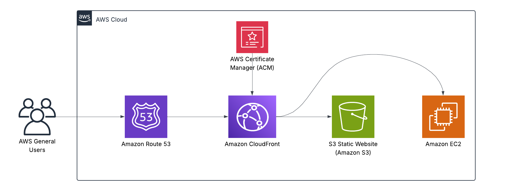

# 🚀 Static Website Deployment on AWS (S3 + Route 53 + CloudFront + HTTPS)

🔗 **Live Demo:** [https://www.deployjimmy.com](https://www.deployjimmy.com)

This project demonstrates a secure and scalable static website deployment on AWS. The site is hosted on Amazon S3, delivered globally via CloudFront, and protected with HTTPS using AWS Certificate Manager. Domain management and routing are handled through Route 53.

---

## ✅ Highlights

- 📦 **Amazon S3** – Static website hosting with public read-only access  
- 🌐 **Route 53** – Custom domain routing for `www.deployjimmy.com`  
- 🔒 **CloudFront + ACM** – CDN and SSL for secure, low-latency global access  
- ⚙️ **Manual AWS Deployment** – Built step-by-step for full understanding  
- 🧭 **DNS Resolution** – Alias A-record points to CloudFront  

---

## 📁 Project Structure

```bash
aws-ec2-s3-route53-webapp/
├── architecture/                  # AWS architecture diagram (PNG)
├── index.html                     # Static website content
├── error.html                     # Custom error page (optional)
├── LICENSE
└── README.md
```

---

## 🗺️ Architecture Overview



---

## 🛠 Deployment Summary

1. Created and configured an S3 bucket named `www.deployjimmy.com`  
2. Enabled static website hosting and uploaded `index.html` and `error.html`  
3. Registered domain and created hosted zone via Route 53  
4. Requested and validated an SSL certificate using ACM  
5. Created CloudFront distribution pointing to the S3 static site endpoint  
6. Connected domain to CloudFront via Route 53 Alias A-record  
7. Verified HTTPS functionality and global access  

---

## 🔧 Backend API (EC2 + Node.js)

In addition to the static frontend hosted on S3, this project includes a live backend API hosted on an EC2 instance.

- Built with **Node.js** and hosted on **Amazon EC2**
- Accessible through a private IP (to be mapped to `api.deployjimmy.com`)
- Returns a JSON response to demonstrate backend capability
- Managed by **PM2** to ensure persistent uptime
- Secured with custom **Security Group** rules to control traffic

---

## 🧠 Skills Demonstrated

- AWS service integration (S3, Route 53, CloudFront, ACM)  
- DNS routing and SSL management  
- Static site deployment using best practices  
- Secure public access configuration  
- CDN-enabled performance optimization  

---

## 🚧 Next Steps

- [ ] Add EC2 backend for dynamic API functionality  
- [ ] Connect `api.deployjimmy.com` to EC2  
- [ ] Integrate monitoring with CloudWatch  
- [ ] Automate infrastructure (Terraform – later)  

---

## 👤 Author

**Jimmy Peralta**  
🛠️ Systems Support Engineer | ☁️ AWS Cloud Enthusiast  
🌐 [https://www.deployjimmy.com](https://www.deployjimmy.com)
